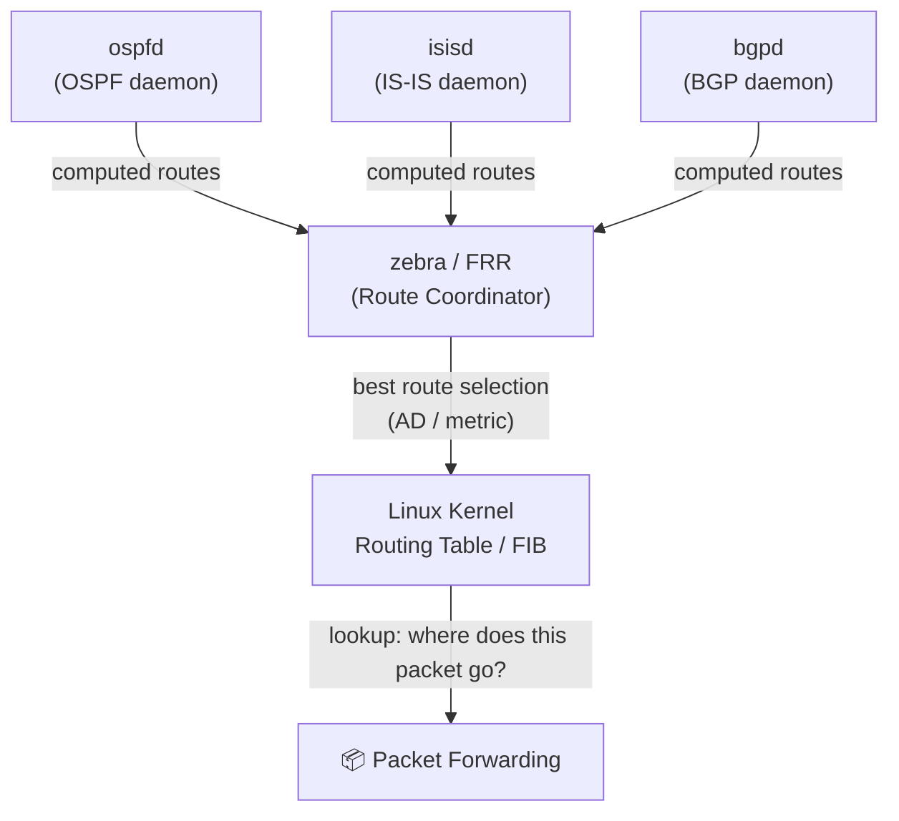
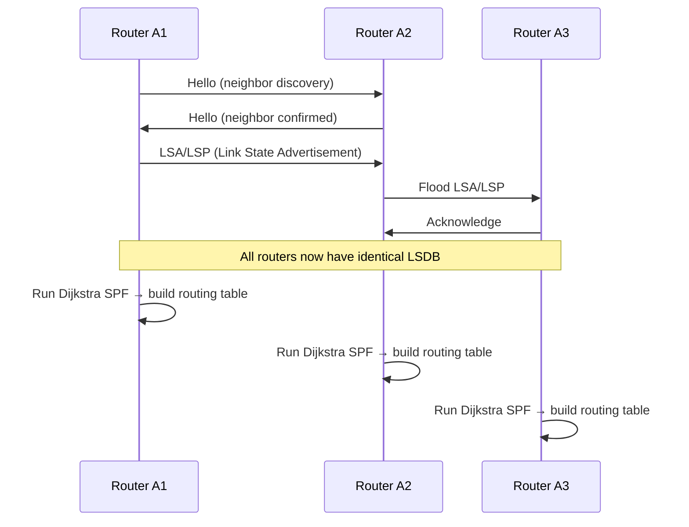
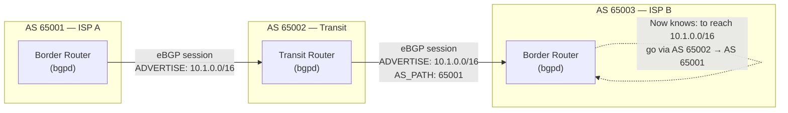
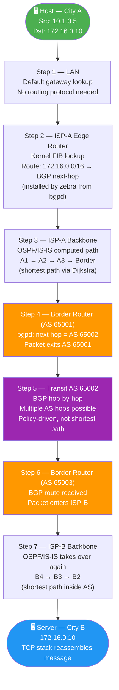
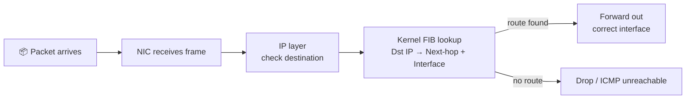
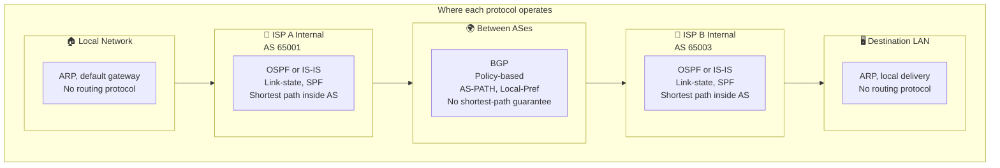

# BGP
In this project we will  simulate a network and configure it using GNS3 with docker images.


# 🌐 How Routing Protocols Work Together — A Packet's Journey from Network A to Network B

> A practical walkthrough of **Zebra/FRRouting**, **OSPF**, **IS-IS**, and **BGP** — from control plane to data plane — illustrated with a packet traveling across two continents.

---

## Table of Contents

- [Overview](#overview)
- [The Two Planes](#the-two-planes)
- [The Network Map](#the-network-map)
- [Phase 1 — Building the Routing Tables (Control Plane)](#phase-1--building-the-routing-tables-control-plane)
  - [Zebra / FRRouting — The Coordinator](#11-zebra--frrouting--the-coordinator)
  - [OSPF / IS-IS — Inside an ISP (IGP)](#12-ospf--is-is--inside-an-isp-igp)
  - [BGP — Between ISPs and Countries](#13-bgp--between-isps-and-countries)
- [Phase 2 — Sending the Packet (Data Plane)](#phase-2--sending-the-packet-data-plane)
- [Step-by-Step Packet Journey](#step-by-step-packet-journey)
- [Protocol Roles Summary](#protocol-roles-summary)
- [Mental Model](#mental-model)

---

## Overview

Imagine a user in **City A** sends a message to a server in **City B**, located on a different continent. The packet must cross:

- A **local LAN** (home/office network)
- An **ISP backbone** in Country A (managed with OSPF or IS-IS)
- An **inter-AS boundary** (managed with BGP)
- A **submarine/backbone transit** (multiple autonomous systems, BGP)
- An **ISP backbone** in Country B (managed with OSPF or IS-IS)
- The **destination server**

Two separate processes make this possible: the **control plane** (building route knowledge) and the **data plane** (actually forwarding packets).

---

## The Two Planes

```
┌─────────────────────────────────────────────────────────┐
│                    CONTROL PLANE                        │
│  Protocols exchange routing info BEFORE packets arrive  │
│                                                         │
│   OSPF / IS-IS ──► Within one ISP / AS                  │
│   BGP          ──► Between different ISPs / ASes        │
│   Zebra/FRR    ──► Collects all routes, installs best   │
│                    into the OS kernel                   │
└─────────────────────────────────────────────────────────┘
                          │
                          ▼ (routing table populated)
┌─────────────────────────────────────────────────────────┐
│                     DATA PLANE                          │
│  Actual IP packets are forwarded hop-by-hop             │
│  Each router reads its kernel FIB and forwards          │
└─────────────────────────────────────────────────────────┘
```

---

## The Network Map

```mermaid
graph LR
    subgraph "Country A — AS 65001"
        A1["🖥️ Host\n(City A)"]
        A2["Router A1\nospfd / isisd"]
        A3["Router A2\nospfd / isisd"]
        A4["Border Router\nbgpd + zebra"]
    end

    subgraph "Transit — AS 65002"
        T1["Transit Router 1\nbgpd"]
        T2["Transit Router 2\nbgpd"]
    end

    subgraph "Country B — AS 65003"
        B4["Border Router\nbgpd + zebra"]
        B3["Router B2\nospfd / isisd"]
        B2["Router B1\nospfd / isisd"]
        B1["🖥️ Server\n(City B)"]
    end

    A1 -->|"Default GW\n(LAN)"| A2
    A2 -->|"OSPF/IS-IS\nIGP"| A3
    A3 -->|"OSPF/IS-IS\nIGP"| A4
    A4 -->|"eBGP"| T1
    T1 -->|"iBGP / eBGP"| T2
    T2 -->|"eBGP"| B4
    B4 -->|"OSPF/IS-IS\nIGP"| B3
    B3 -->|"OSPF/IS-IS\nIGP"| B2
    B2 -->|"LAN delivery"| B1
```



---

## Phase 1 — Building the Routing Tables (Control Plane)

Before a single data packet is sent, every router on the path must already know where to forward it. This is the job of the **control plane**.

---

### 1.1 Zebra / FRRouting — The Coordinator

**Zebra** (part of Quagga/FRRouting) is not a routing protocol itself — it is a **routing manager daemon** that sits between the protocol daemons and the OS kernel.



**Key point:** Each daemon computes its own routes. Zebra picks the *best* one using **Administrative Distance** and installs it in the kernel.

| Source | Default Admin Distance |
|--------|----------------------|
| Connected route | 0 |
| Static route | 1 |
| OSPF | 110 |
| IS-IS | 115 |
| eBGP | 20 |
| iBGP | 200 |

---

### 1.2 OSPF / IS-IS — Inside an ISP (IGP)

Inside a single ISP or organization, **Interior Gateway Protocols** handle routing. Both OSPF and IS-IS are **link-state protocols** — each router builds a complete map of the network and runs the **Dijkstra SPF algorithm** to find shortest paths.



**OSPF vs IS-IS — Key Differences:**

| Feature | OSPF | IS-IS |
|---------|------|-------|
| Standard | RFC 2328 | ISO 10589 |
| Layer dependency | Runs over IP (Layer 3) | Runs directly over Layer 2 |
| Common use | Enterprise, campus | Large ISP backbones |
| Scalability | Good | Excellent |
| Areas | OSPF Areas | IS-IS Levels (L1/L2) |

**Result after IGP convergence:**  
Every router inside ISP-A knows: *"To reach external networks, forward to the border router."*

---

### 1.3 BGP — Between ISPs and Countries

At the **AS boundary**, BGP takes over. BGP is an **Exterior Gateway Protocol (EGP)** — it does not optimize for shortest path, but for **policy and business relationships**.



**BGP route selection uses (in order):**
1. Highest **Local Preference** (stay in your AS longer)
2. Shortest **AS-PATH** (fewest hops between ASes)
3. Lowest **MED** (Multi-Exit Discriminator)
4. **eBGP over iBGP** preference
5. Lowest **IGP metric** to BGP next-hop
6. Lowest **Router ID** as tiebreaker

---

## Phase 2 — Sending the Packet (Data Plane)

Once routing tables are built, the actual data packet is sent. Each router simply **looks up the destination IP in its kernel FIB** and forwards. No protocol negotiation — just fast lookup and forward.

---

## Step-by-Step Packet Journey



### What happens at each router



The kernel FIB was populated by **Zebra** from OSPF, IS-IS, or BGP — but at forwarding time, the router just does a fast table lookup. The routing protocols themselves are completely invisible to the data plane.

---

## Protocol Roles Summary



| Protocol | Scope | Algorithm | Goal |
|----------|-------|-----------|------|
| **OSPF** | Inside one AS | Dijkstra SPF | Shortest path by cost |
| **IS-IS** | Inside one AS (ISP-grade) | Dijkstra SPF | Shortest path, L2-native |
| **BGP** | Between ASes | Best-path selection | Policy + reachability |
| **Zebra/FRR** | Per router (management) | Admin Distance | Install best route in kernel |

---

## Mental Model

```
┌──────────────────────────────────────────────────────────────────┐
│                                                                  │
│   Think of routing like an international postal system:          │
│                                                                  │
│   OSPF / IS-IS  =  The internal sorting system inside           │
│                    a single post office / country               │
│                    → Optimized, knows every local street         │
│                                                                  │
│   BGP           =  The agreement between national               │
│                    postal services on how to hand off mail       │
│                    → Not shortest path — it's about contracts    │
│                                                                  │
│   Zebra / FRR   =  The post office manager who decides:         │
│                    "We got a route from OSPF AND from BGP        │
│                     for the same destination — which do we use?" │
│                    → Picks best, tells the sorting machines      │
│                                                                  │
└──────────────────────────────────────────────────────────────────┘
```

---

## Further Reading

- [FRRouting Documentation](https://docs.frrouting.org/)
- [RFC 2328 — OSPF Version 2](https://datatracker.ietf.org/doc/html/rfc2328)
- [RFC 4960 — IS-IS for IP Internets](https://datatracker.ietf.org/doc/html/rfc1195)
- [RFC 4271 — BGP-4](https://datatracker.ietf.org/doc/html/rfc4271)

---

> 💡 **Want to go further?**
> Try simulating this topology with **GNS3** or **containerlab** — spin up FRRouting containers and watch the routing tables build in real time with `show ip ospf neighbor`, `show bgp summary`, and `ip route`.